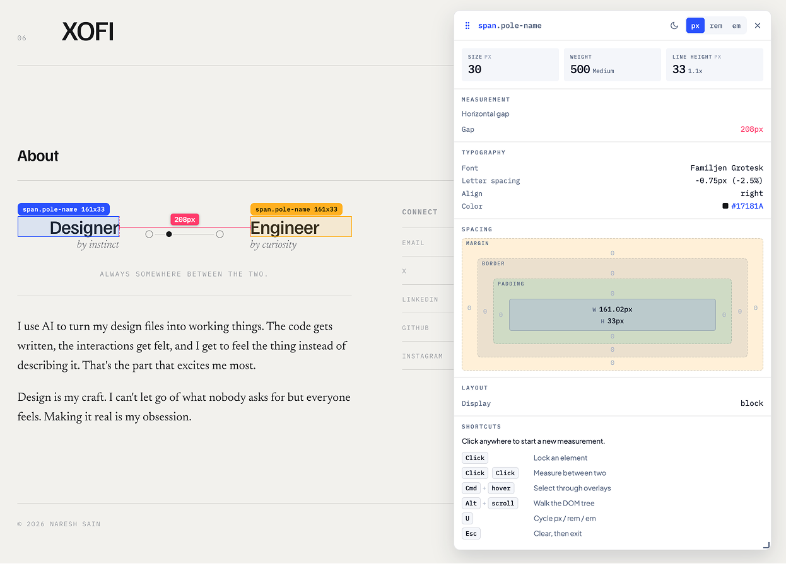
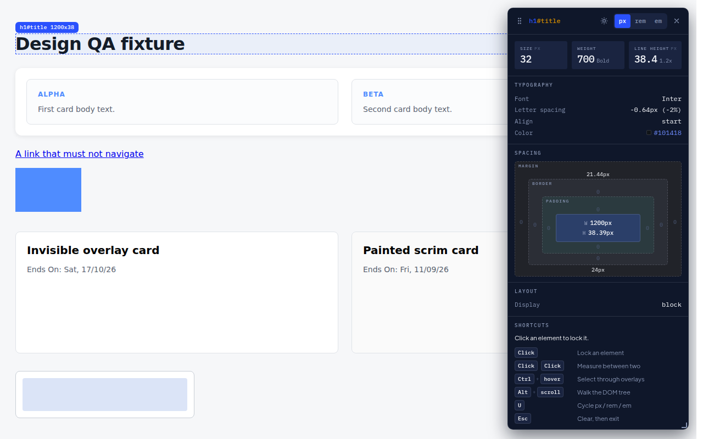

# Design Tool

A Chrome extension that turns any website into something you can QA the way you
review a Figma file. Hover an element to read its type styles. Click two
elements to measure the gap between them. See padding, border and margin as a
spacing box instead of an alphabetical list of CSS.

Built for designers doing design QA, not for reading CSS.



## What it does

- **Type styles at a glance.** Size, weight and line height as large readouts,
  plus family, letter spacing, transform and colour underneath.
- **Measure between two elements.** Dimension lines drawn on the page, with
  extension lines so it is obvious which edges the number spans.
- **A spacing box.** Margin, border, padding and content as nested rings, with
  the container's `gap` stated next to its padding.
- **Design token names instead of raw values.** If the page defines a token
  system, a colour reads as `--color-brand`, with the hex underneath. Copy
  either one.
- **Media, identified.** Whether it is a video or an image, what format it is
  actually being served in, and whether the asset is the right size for the box
  it is drawn in.
- **Both sides of a measurement.** The distance, plus the spec of each of the
  two elements it spans.
- **px, rem and em**, converted everywhere at once. `rem` resolves against the
  page's real root font-size, not an assumed 16px.
- **Click any value to copy it.**

## Permissions

`activeTab`, `scripting` and `storage`. That is all.

There is no host permission and no always-on content script. Nothing is injected
into any page until you click the toolbar icon or press the shortcut, and Chrome
grants access only to that one tab, only for that visit. Install shows no "read
your data on all websites" warning.

It makes no network requests. It stores your unit, theme, card position and card
size, locally, and nothing else.

## Install

[**Install from the Chrome Web Store**](https://chromewebstore.google.com/detail/design-tool/ggnmijonbnnankhpgaiiieejmbdopbka)

Or load it from source:

1. Download or clone this repo.
2. Open `chrome://extensions`.
3. Turn on **Developer mode**, top right.
4. Click **Load unpacked** and select the repo folder.

No build step and no dependencies. Edit a file, press the reload icon on the
extension card, refresh the page you are testing.

## Use it

| Action | What happens |
| --- | --- |
| Toolbar icon, or `Option+Shift+I` (`Alt+Shift+I` on Windows) | Arms inspect mode, badge reads `ON` |
| Hover | The card reads typography, spacing, layout and fill for whatever is under the cursor |
| Click an element | Locks it as **A**, blue |
| Hover another | Live measurement between A and it |
| Click again | Freezes it as **B**, amber |
| Click a third element | Starts a new measurement from that one |
| Hold `Cmd` / `Ctrl` while hovering | Reaches past overlays to the most specific element under the cursor |
| `Alt` + scroll, or `[` / `]` | Walks up and down the DOM |
| `U` | Cycles px / rem / em |
| Click any value | Copies it |
| `Esc` | Clears the measurement. `Esc` again exits |

While inspect mode is armed the page does not receive clicks, so you can measure
a nav link without navigating away.

### The card

It sits in the top-right corner and stays there. It does not follow the cursor
and it does not change corners as you hover.

| Control | What it does |
| --- | --- |
| Grip, top left | Drag to place the card anywhere. Double-click to send it home |
| Corner handle | Drag to resize, 260 to 640 wide |
| Sun / moon | Light or dark |
| ✕ | Stops the tool, same as `Esc` `Esc` |

Position, size and theme persist across pages.

## Reaching the element you actually want

Most card grids are built with a full-bleed click target: an `<a>` or `<span>`
with `position: absolute; inset: 0` stretched over the whole card. It sits on
top of the heading, the date and everything else, so a plain hover lands on it
instead of on what you are looking at.

- An overlay that paints nothing (`opacity: 0`, `visibility: hidden`) is skipped
  outright. You are never pointing at something invisible.
- One that does paint, like a faint scrim, is still the topmost thing, so
  **hold `Cmd` (macOS) or `Ctrl`** to reach the most specific element under the
  cursor. Same idea as selecting through a group in Figma.
- `Alt` + scroll then walks up and down from wherever you landed.

## Design tokens

If the page is built on CSS custom properties, the card names the token rather
than the value it resolved to: `--color-brand` instead of `#2A51FD`, with the
hex still shown underneath. Click the name to copy `var(--color-brand)`, click
the hex to copy `#2A51FD`.

Two things find the token, and they cover different ground:

- **Reading the rule.** The stylesheet rule that styles the element is checked
  for a literal `var(--token)`. Exact, but `.cssRules` throws on a cross-origin
  stylesheet, so a site serving CSS from a CDN gives this path nothing.
- **Matching the value.** Every custom property the page defines is resolved to
  its computed value and matched by value. Works wherever the CSS came from.

A value match is a guess, since two tokens can share a hex, and it is marked
with a dotted underline to say so. When neither finds anything, the raw value is
shown as before.

## Media

Hover an image or video and the card says which it is, what format it is being
served in, and how the asset compares to the box it is drawn in.

- **Format** comes from `currentSrc`, the file the browser actually chose out of
  `srcset`, not the `src` fallback. So a `<picture>` serving WebP reports WebP.
- **Asset scale** is the intrinsic size over the rendered size. Below 1x is
  upscaling and looks soft; 2x is a retina asset; 3x in a small slot is wasted
  bytes.
- **A video that autoplays, loops and is muted with no controls** is reported as
  a background loop, because it behaves nothing like a video someone plays.
- Images also report `srcset`, lazy loading, `object-fit` and whether they have
  alt text.

## What the measurements mean



- **Two elements side by side or stacked**: one gap number, drawn between the
  facing edges.
- **One element inside another**: four numbers, one per edge, because a single
  number would be a lie. Measured from the container's **padding box**, so a
  12px padding with a 1px border reads as 12px, not 13px.
  `getBoundingClientRect()` returns the border box, and the border is already
  reported on its own in the spacing diagram.
- **Elements offset on both axes**: the horizontal and vertical components
  separately, not a diagonal nobody designs against.

Under the number, both measured elements are described side by side in the same
A/B colours as the on-page highlights: the type spec for text, width and height
for a box. "24px between what?" is the next question every time.

## Known limits

- **Iframes.** The tool runs inside each frame independently. Measuring an
  element in the page against one inside an iframe is not supported.
- **Highlight badges** show rendered size in px whatever the unit toggle says.
  The card is the source of truth for converted values.
- **Strict CSP sites** may refuse the bundled fonts, and the card falls back to
  system fonts. Everything else still works.
- **Canvas and WebGL** are inspected as the element that contains them; there
  is no way to reach inside what they draw.
- **Token matching by value** cannot tell two tokens with the same hex apart.
  The dotted underline marks a match it inferred rather than read.

## Development

The extension itself has **no dependencies and no build step**. You only need
npm to run the tests.

```bash
npm install         # Playwright plus the Chromium it drives, for the tests only
npm test            # manifest checks, geometry units, then the browser suite
npm run test:unit   # geometry only, runs in a second, no browser
npm run package     # builds dist/design-tool-<version>.zip for the Web Store
npm run dev         # builds ./dev/, a side-by-side copy for local testing
```

### Running the dev copy next to the published one

An unpacked folder and the Web Store listing get different extension IDs, so
Chrome treats them as two unrelated extensions. Both can be installed at once
and they do not share storage, which is what you want: test locally without
touching the version you actually use.

What they would otherwise share is a name, an icon and a shortcut. `npm run
dev` writes a `dev/` folder that fixes all three:

- named **Design Tool (Dev)**
- **black** icon (brand Ink) instead of brand blue
- **Alt+Shift+D**, leaving Alt+Shift+I to the published build

Load `dev/` once via **Load unpacked**. After that, re-run `npm run dev` and
press reload on the extension card to pick up code changes. `dev/` is
gitignored and generated from `manifest.json` and `src/` at build time, so a
dev name or colour can never reach a store release.

`npm install` also downloads a Chromium for Playwright to drive, which is the
slow part and is a few hundred MB. If it was skipped, the browser suite fails
with "Looks like Playwright was just installed"; run `npx playwright install
chromium` to fix it.

`npm run package` and `npm run test:unit` need neither Playwright nor the
browser.

The browser suite drives a real Chromium with the extension loaded. It runs
against a **patched copy** built by `test/build-test-extension.mjs`: the shipped
manifest only has `activeTab`, which Chrome grants on a real toolbar click, and
Playwright cannot click browser chrome, so the copy adds a content script back.
`test/manifest.test.mjs` asserts the shipped manifest stays minimal, so the two
cannot quietly diverge.

The mouse moves in small steps rather than teleporting. A scripted click jumps
straight to its target, which is the one way a human never approaches anything,
and it let an unreachable card ship once already.

## Layout

```
manifest.json              MV3 manifest
src/background.js          service worker: toolbar, command, per-tab state
src/content/
  index.js                 state machine and paint loop
  inspect.js               event capture and element picking
  styles.js                computed styles into designer vocabulary
  units.js                 px / rem / em conversion
  tokens.js                design token names for computed values
  measure.js               gap geometry, pure functions
  overlay.js               closed shadow root, highlights, dimension lines
  card.js                  the card
  spacing-box.js           the margin/border/padding diagram
  prefs.js                 persisted unit, theme, position, size
src/ui/overlay-styles.js   all injected CSS, as a string
src/icons/icon.svg         icon source, exported from Figma
src/fonts/                 the two brand typefaces, with their OFL licences
test/fixture.html          a page with known-correct values to check against
test/verify.mjs            end-to-end checks in a real Chromium
test/measure.test.mjs      geometry unit tests, no browser
test/manifest.test.mjs     keeps the shipped manifest minimal
test/build-test-extension.mjs  patched copy the browser suite drives
test/package.mjs           builds the Web Store zip
test/render-icons.mjs      regenerates the icon PNGs from icon.svg
```

## Licence

Code is MIT, see [LICENSE](LICENSE).

The bundled typefaces are SIL Open Font License 1.1, with their licence texts in
`src/fonts/`. The Design Tool name and logo are not covered by the MIT licence.

`DESIGN.md` is the visual system. `DECISIONS.md` is why things are the way they
are, including the things that turned out to be wrong.
